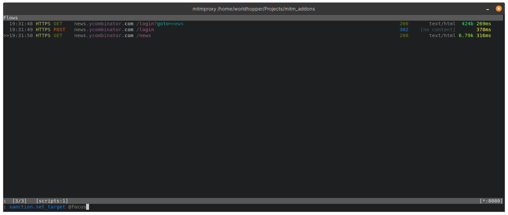
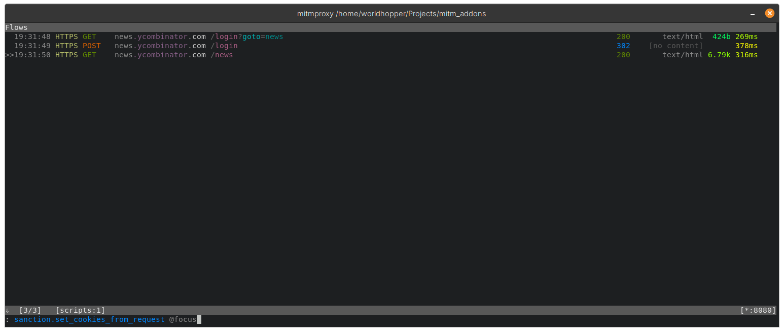
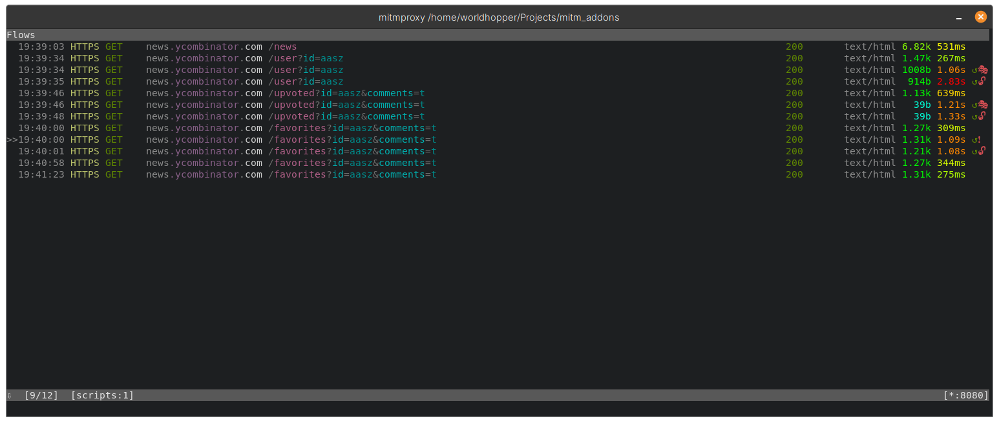

# Sanction
An mitmproxy addon that tests authorisation controls

An mitmproxy addon that replicates the functionality of [Autorize](https://github.com/Quitten/Autorize). For more details check out the [Blog post](https://blog.aalsuwaidi.com/posts/sanction_mitmproxy/)

# How to use Sanction

Clone the repository and start mitmproxy with sanction loaded using the ```-s``` flag:

>`mitmproxy -s sanction.py`

Sanction provides 6 commands in mitmproxy:

`sanction.set_target` - Sets the target host to match against. Default value is *
> This command must be called with a selection. For example: `sanction.set_target @focus`

`sanction.set_cookies_from_request` - Selects the cookies from the chosen request and loads them into Sanction.

> This command must be called with a selection. For example: `sanction.set_cookies_from_request @focus`

`sanction.set_authorization_from_request` - Selects the authorisation header from the chosen request and loads it into Sanction.

> This command must be called with a selection. For example: `sanction.set_authorization_from_request @focus`

`sanction.activate` - Activates Sanction

`sanction.false_positive` - Specifies that the URL selected is a false positive

> This command must be called with a selection. For example: `sanction.false_positive @focus`

`sanction.deactivate` - Deactivates Sanction

# How it works

Let us try it out on Hacker News, start mitmproxy with the addon loaded using `mitmproxy -s sanction.py` and login to an account (Might be a low privilege account).

Go to the request in mitmproxy and set the target using the `sanction.set_target` command:



On the same request run the `sanction.set_cookies_from_request` to copy the user cookies into Sanction: 



Now open a new window and login to a separate account (When testing this might be a higher privilege account). Start Sanction by running `sanction.activate`, and it will begin replaying each request twice:

1. One request with no authentication - These are marked with :unlock:
2. One request with the low privilege account authentication - These are marked with :performing_arts:

Endpoints can be marked as false positives with the `sanction.false_positive` command. All the above can be seen in the screenshot below.

Currently, Sanction does a quick similarity check on the responses from the modified and unmodified requests. If the responses are similar the mark will be updated to :heavy_exclamation_mark: to notify the user that there is a potential issue. This is still in development, but more advanced processing of the responses can be added.




> Note that the last two requests are not replayed as the endpoint was marked as false positive